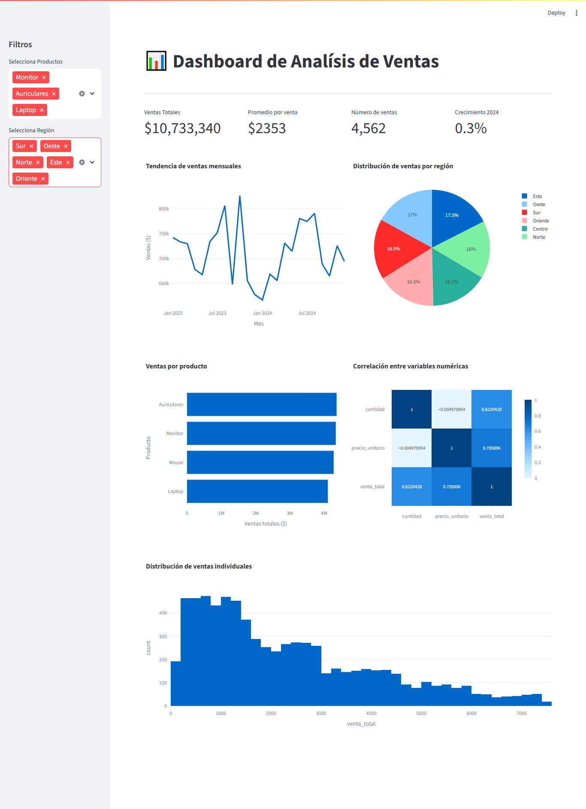

# 📊 Dashboard de Análisis de Ventas

Este proyecto es un **dashboard interactivo** desarrollado en **Python** usando **Streamlit**, diseñado para visualizar y analizar ventas simuladas de productos tecnológicos en distintas regiones durante los años 2023 y 2024.

##  Tecnologías utilizadas

- [Streamlit](https://streamlit.io/) – Framework para crear dashboards interactivos
- [Pandas](https://pandas.pydata.org/) – Manipulación de datos
- [Plotly](https://plotly.com/python/) – Visualización interactiva
- [Seaborn & Matplotlib](https://seaborn.pydata.org/) – Análisis gráfico complementario
- [NumPy](https://numpy.org/) – Generación de datos sintéticos

##  Funcionalidades

- Filtros dinámicos por **producto** y **región**
- Visualización de:
  - Tendencia de ventas mensuales
  - Top de productos por ventas
  - Distribución de ventas por región
  - Mapa de correlación entre variables
  - Histograma de ventas individuales
- Cálculo de métricas clave:
  - Ventas totales
  - Promedio por venta
  - Número de transacciones
  - Crecimiento interanual (2024 vs 2023)

## crear el entorno virtual 
```bash
python3 -m venv venv
```
activar el entorno virtual en windows
```bash
venv/Scripts/activate
```
en mac o linux 
```bash
source venv/bin/activate
```

## instalar los paquetes 
```bash
pip install streamlit plotly pandas numpy seaborn matplotlib
``` 
##  Ejecutar el proyecto

```bash
streamlit run app.py
``` 

img demo
